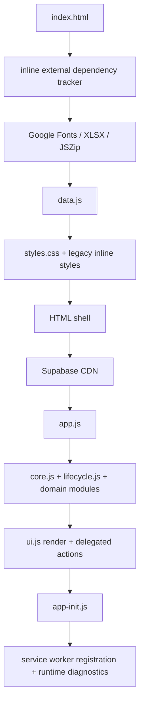
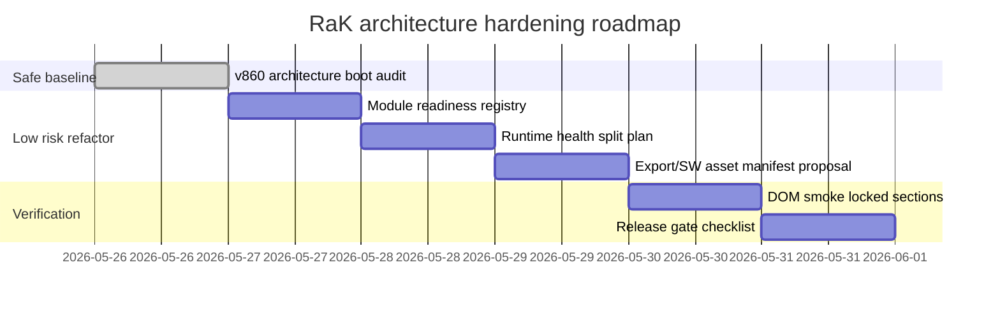

# RaK architecture / boot baseline audit – v.1.5 (860)

Účel buildu: vytvořit bezpečný auditní baseline pro architekturu a boot sekvenci bez zásahu do funkční logiky her, Supabase policies, dashboardu, spodní lišty nebo kalkulaček.

## Exekutivní shrnutí

Aplikace je statická PWA s modulárním rozdělením do více JS/CSS souborů, ale pořád má silný historický coupling přes globální `window` symboly, DOM ID a implicitní pořadí skriptů v `index.html`. To je funkční, ale při dalších refactorech je největší riziko v tom, že pozdější modul počítá s globálem, který vznikl dříve bez explicitního readiness kontraktu.

Nejbezpečnější směr není rewrite. Doporučený postup je malý strangler/refactor po vrstvách: nejdřív mapovat readiness modulů, potom vytahovat auditní/runtime helpery z `app.js`, potom sjednocovat globály pod jeden namespace a nakonec přidat DOM smoke testy pro zamčené části.

## Boot sekvence

## Runtime vrstvy

| Vrstva | Hlavní soubory | Odpovědnost | Riziko |
|---|---|---|---|
| Boot shell | `index.html`, `app-init.js` | Pořadí načtení, CDN tracking, start appky | P1 při změně pořadí skriptů |
| Core state/router | `core.js`, `app.js`, `lifecycle.js` | globální stav, routing, runtime audity | P1/P2 kvůli globálům |
| UI render | `ui.js`, CSS soubory | stránky, modaly, diagnostika, menu | P1 při DOM/ID změnách |
| Doménové moduly | `dashboard.js`, `rotace.js`, `stats.js`, `soustruhy.js`, `brusy.js`, `games-arcade.js` | funkční části aplikace | P1 u zamčených částí |
| Persistence | localStorage/sessionStorage | profily, cache, offline stav | P1 u resetů a migrací |
| Supabase bridge | `supabase-config.js`, `supabase-bridge.js` | online sync, realtime, queue, RPC | P0/P1 u policies/write flow |
| PWA/export | `sw.js`, `manifest.webmanifest`, `export.js` | cache, offline, ZIP export | P1 u stale cache/update flow |

## Hlavní coupling body

1. `index.html` pořadí skriptů je implicitní kontrakt. Změna pořadí může rozbít globály bez compile-time chyby.
2. `app.js` stále obsahuje hodně runtime auditů, helperů a baseline kontrol. Je vhodný kandidát na budoucí rozdělení.
3. `ui.js` čte mnoho volitelných globálních health funkcí. Je to praktické pro diagnostiku, ale křehké bez registru modulů.
4. Export ZIPu ručně udržuje seznam textových/binárních souborů. Každý nový dokument/asset musí být přidán dvakrát.
5. Service worker a export ZIP mají podobnou inventuru runtime souborů, ale nejsou generované ze společného manifestu.

## Prioritizované nálezy

| Priorita | Nález | Doporučení | Riziko regrese |
|---|---|---|---|
| P1 | Implicitní boot pořadí přes globály | Přidat `window.RaK.modules` readiness registr | medium |
| P1 | Export/SW inventury jsou ruční | Zavést jeden zdroj pravdy `APP_ASSET_MANIFEST` | medium |
| P2 | `app.js` obsahuje směs runtime auditů a business logiky | Vytahovat po malých blocích do `runtime-health.js` | low/medium |
| P2 | Diagnostika závisí na volitelných globálech | Zabalit health funkce přes safe registry helper | low |
| P2 | Bez automatického DOM smoke testu zamčených částí | Přidat Playwright smoke pro home, rotace, rozpisy, statistiky, kalkulačky, hry | low |

## Refaktor vs rewrite vs strangler

| Oblast | Doporučení | Proč |
|---|---|---|
| Boot/index | refaktor in-place | Malý souborový zásah, vysoké riziko při rewrite |
| Runtime audity v `app.js` | strangler | Vytahovat po blocích, zachovat globální API |
| Hry | refaktor in-place | Jsou funkčně citlivé a už doladěné mobile-first |
| Supabase bridge | strangler | Nutné zachovat fallbacky a policies nedotahovat naslepo |
| UI/CSS | refaktor in-place | Zamčené části neměnit bez důvodu |
| Celá appka | nerewritovat | Riziko regresí je větší než přínos |

## Bezpečný fázový plán

## Doporučený další krok

Další build by měl být pouze nízkorizikový: přidat interní readiness registr modulů bez změny jejich chování. Registr má jen zapisovat, co se načetlo, v jakém pořadí a jestli existují očekávané globály. Teprve po ověření lze začít vytahovat menší části runtime auditů z `app.js`.

## Ověření po buildu

- JS syntax všech modulů.
- Manifest JSON.
- Duplicitní DOM ID.
- CSS brace kontrola.
- ZIP struktura.
- Kontrola verzí/cache/realtime.
- Browser/mobil smoke zatím nutný ručně po nasazení.
