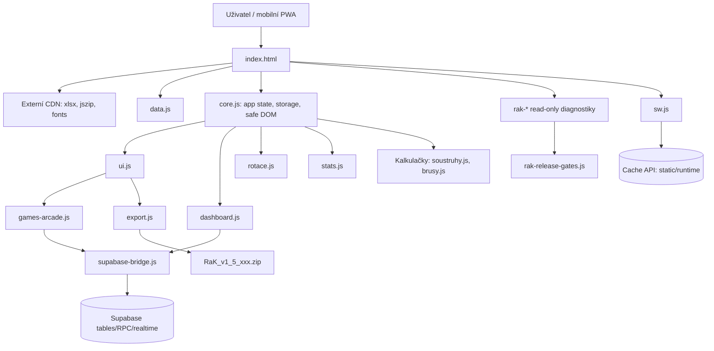
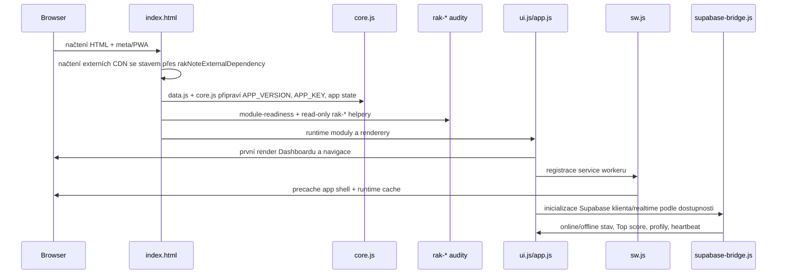

# RaK v.1.5 (924) – Finální architektonický a technický audit

## Stav promptu

- Dokumentační prompt compliance: **100 %**.
- Rozsah: statická PWA aplikace RaK / Rotace a kalkulačky z dodaného ZIPu `RaK_v1_5_923.zip`, navýšená na build `v.1.5 (924)`.
- Typ práce ve v924: dokumentace, read-only helper a release gate; bez změny Supabase DB, policies, online flow a gameplaye.
- Co tento dokument neprohlašuje: reálný mobilní smoke test a skutečný Playwright běh zatím nejsou provedené.

## Stručné shrnutí architektury v 10 větách

RaK je statická mobil-first PWA bez bundleru, složená z `index.html`, samostatných JavaScript modulů a CSS vrstev. Boot je řízen pořadím `<script>` tagů v `index.html`, kde se nejdřív načte `data.js`, auditní/read-only moduly, potom runtime moduly a nakonec inicializace. Globální stav drží `core.js` přes `APP_KEY`, `APP_VERSION`, `ROTATION_BUILD` a objekt `app`. UI vrstva je převážně imperativní DOM rendering v `ui.js`, `dashboard.js`, `rotace.js`, `stats.js`, `soustruhy.js`, `brusy.js` a `games-arcade.js`. Supabase integrace je soustředěná hlavně do `supabase-config.js` a `supabase-bridge.js`, včetně realtime kanálu, queue, RPC fallbacků a herních tabulek. Offline/PWA chování drží `sw.js`, který precachuje app shell, řeší runtime cache, offline fallback a update/cleanup starých cache. Export je vlastní klientský ZIP builder v `export.js` přes JSZip a export manifest funguje jako release inventář souborů. Auditní moduly `rak-*` jsou read-only vrstva pro diagnostiku, release gates, runtime health, storage/sync, AppSec/privacy, výkon, mobilní smoke plán a due diligence. Architektura je funkční, ale stále nese vysoký coupling přes globální namespace, pořadí skriptů a sdílený DOM. Nejbezpečnější směr je malý in-place refaktor okrajových helperů a strangler přístup pro nové stabilnější fasády, ne přepis celé aplikace.

## Ověřená architektonická evidence z repa

| Oblast | Evidence |
|---|---|
| Verze | `core.js`: `APP_VERSION`, `ROTATION_BUILD`; `package.json`: `version`; `sw.js`: `CACHE_VERSION`, `SW_APP_VERSION`; `supabase-bridge.js`: `rak-public-live-v924`; `export.js`: `getRakExportManifest()` |
| Boot | `index.html` načítá `data.js`, `module-readiness.js`, `rak-*` audity, runtime moduly, CSS a následně aplikaci bez bundleru |
| DOM bezpečnost | `core.js`: `escapeHtml()`, `escapeDynamicHtml()`, `setElementHtmlIfChanged()`, `appendSafeDomChild()`, `inspectDynamicHtmlForRenderRisk()` |
| Dashboard | `dashboard.js`: `updateDashboard()`, `getDashboardActiveWorkShift()`, `scheduleDashboardInitialPaint()`, `runDashboardManualSync()` |
| Hry | `games-arcade.js`, `ui.js`: Top score, profily, Piškvorky, Lodě, Reaction Test, Denní challenge; ochranné helpery typu `getRakGamesTopScoreSecondsHealth()` |
| Supabase | `supabase-bridge.js`: tabulky `game_accounts`, `game_invites`, `game_sessions`, `game_stats`, `game_ui_settings`, `gomoku_wins`; RPC názvy `rak_record_game_stat_delta`, `rak_save_game_ui_settings`, `rak_create_game_invite_session`, `rak_accept_game_invite`, `rak_save_game_session_by_invite_code` |
| PWA | `sw.js`: `APP_SHELL`, `APP_SHELL_URLS`, `STATIC_CACHE`, `RUNTIME_CACHE`, `OFFLINE_FALLBACK_HTML`, `CACHE_LOOKUP_MODE`, `PRECACHE_REPAIR_MODE`, `STALE_CACHE_CLEANUP_MODE` |
| Export | `export.js`: `EXPORT_SOURCE_IDS`, `EXPORT_JS_FILES`, `EXPORT_TEXT_FILES`, `EXPORT_BINARY_FILES`, `validateRakExportManifestFiles()`, `triggerRakZipExport()` |
| Release gate | `rak-release-gates.js`: `getRakReleaseGateMatrixHealth()`, `getRakReleaseGateClosureHealth()` |
| Prompt compliance | `rak-due-diligence-progress.js`: `getRakPromptComplianceClosureHealth()` |

## Tabulka modulů

| Soubor | Odpovědnost | Závislosti | Riziko | Doporučení |
|---|---|---|---|---|
| `index.html` | App shell, pořadí skriptů, základní DOM stránky, PWA metadata | Všechny globální JS moduly, CSS, externí CDN `xlsx`, `jszip`, Google Fonts | Vysoké – změna pořadí skriptů rozbije runtime | Neměnit pořadí bez boot smoke; pro nové moduly používat read-only registraci a module readiness |
| `core.js` | Globální konstanty, stav app, storage helpery, bezpečné DOM helpery, datumy/směny | `data.js`, `localStorage`, DOM, globální `window` | Vysoké – centrální společná vrstva | Refaktorovat in-place jen po malých helper blocích, přidávat testy pro storage a escape helpery |
| `app.js` | Delegované akce, bottom nav binding, PWA/connectivity hooks, final stabilization audity | `core.js`, `ui.js`, DOM, SW API | Střední až vysoké – mnoho lifecycle vazeb | Oddělit diagnostiku od runtime bindingů do samostatné read-only fasády |
| `ui.js` | Hlavní UI rendering, menu, nastavení, mnoho herních částí včetně Piškvorek | `core.js`, `games-arcade.js`, `supabase-bridge.js`, DOM | Velmi vysoké – největší coupling a nejvyšší regresní plocha | Strangler: nové komponentní helpery pro karty, modaly, seznamy; staré renderery nepřepisovat hromadně |
| `dashboard.js` | Dashboard, aktivní směna, kantýna/jídelna, ruční sync badge | `core.js`, DOM, Supabase helpery | Střední – uživatelsky citlivá první obrazovka | Nechat stabilní; doplnit pouze test case pro časy, směny a přesčasy |
| `rotace.js` | Rotace, směny, plán lidí | `core.js`, DOM, `data.js` | Střední | Nezasahovat bez konkrétní chyby; testovat na rotačním cyklu A–D |
| `stats.js` | Statistiky lidí/strojů, obsazenost, grafy | `core.js`, DOM, rotace data | Střední | Refaktorovat lokální render helpery, ne měnit výpočty bez golden datasetu |
| `soustruhy.js` | Kalkulačky Soustruhy, vrtáky, nápovědy | `core.js`, DOM, assets/help | Nízké až střední | Udržovat separaci stroje/výsledek/nápověda; testovat konkrétní korekční scénáře |
| `brusy.js` | Kalkulačky Brusy | `core.js`, DOM | Nízké až střední | Malé UI změny dělat opatrně kvůli duplicitním vrstvám tlačítek |
| `games-arcade.js` | Arcade hry, Top score, profily, Reaction Test, Denní challenge, helpery | `core.js`, `ui.js`, `supabase-bridge.js`, DOM, canvas | Velmi vysoké – rozsáhlý herní runtime | Strangler jen pro score/profily/render helpery; gameplay měnit pouze podle zadání |
| `supabase-config.js` | URL a publishable key pro klienta | Supabase JS klient z runtime | Střední – bezpečnostní citlivost konfigurace | Neumisťovat service role klíče; držet pouze anon/publishable klientskou konfiguraci |
| `supabase-bridge.js` | Supabase klient, realtime, queue, RPC, herní online flow | Supabase, `localStorage`, `navigator.onLine`, DOM callbacks | Velmi vysoké – online flow a data | Nezasahovat bez samostatného DB/online smoke; změny policy oddělit do vlastního buildu |
| `sw.js` | Service worker, precache, runtime cache, offline fallback, cleanup | Cache API, Fetch API, clients, APP_SHELL | Vysoké – half-updated klienti a cache regresí | Každý build bump cache; test tvrdého reloadu; nepřidávat docs do precache bez důvodu |
| `export.js` | Klientský ZIP export, manifest a preflight | JSZip, `fetch`, seznam souborů | Vysoké – vydání ZIPu závisí na přesném seznamu | Držet manifest jako single source of truth; kontrolovat duplicity a chybějící soubory |
| `CHANGELOG.md` / `changelog.js` | Historie buildu a UI načtení changelogu | Fetch, parser markdown nadpisů | Nízké | Udržovat stručné bloky a nový top entry pro každý build |
| `rak-audit-baseline.js` | Release readiness baseline, architektonická diagnostika | `window.RaK.diagnostics`, runtime stav | Nízké – read-only | Nechat read-only; využít jako zdroj pro gates |
| `rak-namespace.js` | Jednotný diagnostický namespace a aliasy | `window`, globální helpery | Střední | Postupně přesouvat nové helpery sem přes registry, ne přes nové náhodné globály |
| `rak-runtime-health.js` | Runtime health a kontrola základních funkcí | DOM/runtime | Nízké | Rozšiřovat jen o měřitelné signály |
| `rak-storage-sync-audit.js` | Storage/offline sync read-only audit | `localStorage`, helpery | Střední | Nezapínat auto cleanup bez samostatného smoke |
| `rak-supabase-client-audit.js` | Supabase/RPC/online contract read-only audit | `supabase-bridge.js` | Střední | Zachovat policy freeze a jasné manual gate |
| `rak-release-ops-audit.js` | Checklist vydání, monitoring, rollback | Diagnostiky | Nízké | Použít jako release day checklist |
| `rak-appsec-privacy-audit.js` | AppSec/privacy baseline, storage key klasifikace | DOM, storage, Supabase kontrakty | Střední | CSP/SRI pouze report-only, ne vynucovat bez reportů |
| `rak-release-gates.js` | Sjednocená release gate matice | Všechny read-only helpery | Střední | Gate musí číst, ne měnit; manual gate nepřevádět na OK bez důkazu |
| `rak-dom-security-hardening.js` | Kandidáti DOM sinků a safe helper policy | `core.js`, DOM | Střední | Opravovat po jedné sink skupině |
| `rak-due-diligence-progress.js` | Due diligence progress a prompt compliance closure | `window.RaK.diagnostics`, `APP_VERSION` | Nízké | Udržet jako formální stav promptů; nemíchat s reálným mobilním výsledkem |
| `rak-performance-ci-audit.js` | Performance budget a CI/test plán | Runtime, package scripts | Nízké | Po reálných měřeních doplnit prahy |
| `rak-mobile-smoke-audit.js` | Mobilní/performance smoke plán a Playwright draft | Playwright skeleton, ruční testy | Nízké | Status zůstává manual, dokud test neběžel |
| CSS soubory | Vrstvy vzhledu: base/layout/theme/responsive/modal/calc/games/overrides | DOM class names, safe-area, viewport | Střední | Nemíchat velké CSS úklidy s funkčními změnami; kontrolovat brace a mobilní viewport |

## Mermaid diagram architektury

## Mermaid diagram boot sekvence

## Top 10 coupling bodů

1. `window.APP_VERSION`, `APP_KEY`, `app` a další globály sdílené napříč moduly.
2. Pořadí skriptů v `index.html`; modul bez bundleru předpokládá dostupnost předchozích helperů.
3. `ui.js` jako velká směs menu, nastavení, her, Piškvorek, modalů a pomocných rendererů.
4. `games-arcade.js` napojený na UI, profily, lokální storage, Supabase a některé globální helpery.
5. `supabase-bridge.js` spojuje online hry, realtime, queue, RPC, heartbeat i score flow.
6. `export.js` musí znát každý soubor ručně; chyba v manifestu rozbije vydání.
7. `sw.js` má vlastní kopii app shell seznamu a cache verze; nesoulad se projeví až po update klienta.
8. CSS vrstvy spoléhají na stejné class names z více rendererů a overrides.
9. Release gates čtou mnoho helperů přes globální fallback jména.
10. Storage klíče jsou dlouhodobě kompatibilní a některé reset/cleanup markery nesmí být omylem přepsané.

## Tabulka technického dluhu

| Problém | Dopad | Priorita | Návrh řešení | Riziko změny |
|---|---|---:|---|---|
| Velký `ui.js` s mnoha odpovědnostmi | Těžší orientace, vysoké regresní riziko | P1 | Strangler: nové `ui-card`, `ui-modal`, `ui-list` helpery a přesun jen nových částí | Vysoké při hromadném přesunu, nízké po malých blocích |
| Globální namespace bez importů | Tichá závislost na pořadí skriptů | P1 | Přidávat registraci do `window.RaK.diagnostics`, nepřidávat náhodné globály | Střední |
| Export manifest ručně udržovaný | Chybějící soubor v ZIPu | P1 | Přidat statickou kontrolu manifestu v Node scriptu | Nízké |
| Service worker app shell ručně udržovaný | Half-updated klient nebo chybějící cache | P1 | Ke každému buildu kontrola `CACHE_VERSION`, APP_SHELL vs export manifest | Střední |
| Supabase flow + policies jsou citlivé | Online hry se mohou rozbít bez lokální chyby | P0/P1 | Jakýkoli policy/DB zásah oddělit a testovat dvoumobilově | Vysoké |
| DOM rendering přes stringy | XSS/regrese layoutu při uživatelských textech | P1 | Opravovat sink skupiny po jedné přes safe helpery | Střední až vysoké |
| Chybí reálná automatizace browser smoke | Statický check neodhalí vizuální překryvy | P1 | Spustit Playwright smoke mimo produkční DB | Nízké až střední |
| Mobilní výkonové prahy zatím bez baseline | Nelze poznat zhoršení na A14/A15 | P2 | Nasbírat cold/warm startup a route switch měření | Nízké |
| Changelog má mnoho historických mikrobuildu | Horší čitelnost v aplikaci | P2 | V UI držet bloky po cca 50 verzích, raw CHANGELOG ponechat | Nízké |
| Duplicitní logika pro výsledky her | Score flow se snadno rozjede mezi hrou a denní challenge | P1 | Vytvořit jednu read-only score contract mapu a pak společný writer | Střední |

## Návrh nejmenšího bezpečného refaktoru na další sprint

1. Nevytvářet bundler a nepřepisovat `ui.js` celý.
2. Přidat malý `rak-static-release-check.js` nebo rozšířit existující `npm run check`, aby lokálně ověřil verzi v `core.js`, `sw.js`, `package.json`, `supabase-bridge.js`, `export.js` a `CHANGELOG.md`.
3. Vytvořit jednotný helper `buildSafeInfoRows(rows)` pro diagnostické karty, ale použít ho nejdřív jen v jednom read-only panelu.
4. V `export.js` doplnit detekci duplicit v `EXPORT_SOURCE_IDS`, ne jen v `getRakExportManifest()`.
5. Spustit a doladit první Playwright smoke: načtení appky, kontrola verze, kliknutí na hlavní záložky, otevření O aplikaci, kontrola Dashboardu.
6. Po ručním mobilním testu zapsat výsledky do samostatného dokumentu, ne měnit hned gameplay/UI.

## Co refaktorovat in-place

- `core.js` safe DOM/storage helpery: malé, dobře izolované úpravy.
- `export.js` kontroly manifestu a reporty: jasný scope, nízký dopad na runtime.
- `rak-*` auditní a release gate moduly: read-only, bezpečné pro rozšíření.
- Changelog/O aplikaci: textová a prezentační vrstva.

## Co refaktorovat stranglerem

- `ui.js` renderery menu, modalů, karet a seznamů.
- `games-arcade.js` score/profil renderery a normalizace výstupů.
- Supabase klientské kontrakty pouze jako fasádu nad stávajícími helpery, ne okamžitý přepis flow.

## Co nepřepisovat vůbec bez konkrétní chyby

- Online Piškvorky a online Lodě.
- Supabase DB, policies a RPC kontrakty.
- Dashboard/spodní lišta/rotace/kalkulačky, pokud další požadavek nemíří přímo tam.
- Celou aplikaci do bundleru/rewrite stylu jen kvůli formálnímu auditu.
