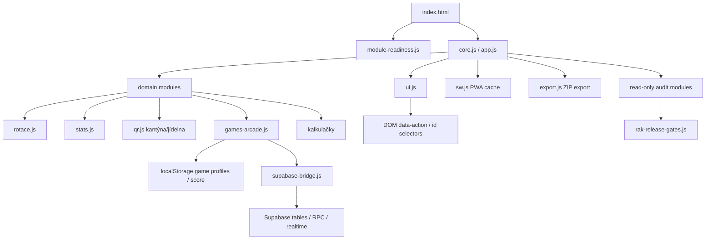
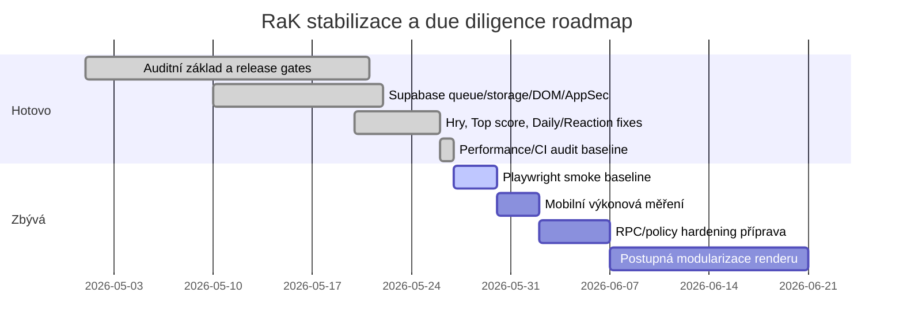

# RaK v.1.5 (920) – Finální sjednocený due diligence report

## Exekutivní shrnutí

Aplikace RaK je statická PWA / vanilla JS aplikace s více samostatnými skripty, lokální perzistencí, service workerem, exportem zdrojového ZIPu a Supabase bridge vrstvou. Z dodaného ZIPu je ověřitelné, že aplikace má funkční modulární rozdělení po souborech, ale stále využívá výrazný globální runtime (`window`, globální helpery, DOM podle `id`/`data-action`) a větší části historického kódu v `ui.js`, `games-arcade.js`, `supabase-bridge.js` a souvisejících modulech.

Největší rizika jsou dnes v těchto oblastech: klientská Supabase write plocha, absence plnohodnotného automatizovaného E2E smoke testu, service worker/PWA cache update flow na mobilech, množství DOM HTML renderů a postupně rostoucí technický dluh. V posledních buildech byly přidané read-only audity, release gates, AppSec/privacy baseline, výkonový audit, rollback playbook a postupné DOM/security hardening guardy. To výrazně zlepšilo kontrolovatelnost releasů bez přímého přepisu hotových funkcí.

Doporučení: rewrite celé aplikace nedává smysl. Nejmenší bezpečný krok je pokračovat ve strangler přístupu: po malých blocích oddělovat render, storage a Supabase kontrakty, přidat minimální CI a první Playwright smoke testy, a až po reálném dvoumobilovém testu případně řešit další utažení Supabase policies.

## Ověřené runtime vrstvy

| Vrstva | Reálné soubory / části | Stav | Riziko |
|---|---|---:|---|
| HTML shell | `index.html` | existuje, skripty načítané klasicky | střední coupling na pořadí skriptů |
| UI / routing | `ui.js`, `app.js`, `dashboard.js` | funkční, mnoho DOM vazeb | P2 technický dluh |
| Business logika | `rotace.js`, `stats.js`, `payroll.js`, `qr.js`, kalkulačky | rozdělená podle domén | P2 coupling přes globály |
| Hry | `games-arcade.js`, části `ui.js` | aktivně rozvíjené | P1/P2 kvůli score, DOM a mobilnímu layoutu |
| Storage/offline | `rak-storage-sync-audit.js`, localStorage helpery | auditní guardy existují | P1 bez E2E offline testu |
| Backend bridge | `supabase-bridge.js`, `supabase-config.js` | funkční, citlivé na policies | P1 anonymní write/read plocha |
| PWA | `sw.js`, `manifest.webmanifest` | cache/versioning kontrolovaný | P1 mobilní cache regresí |
| Release/diagnostika | `rak-release-gates.js`, `rak-release-ops-audit.js`, `rak-runtime-health.js` | silně posíleno | P2 zatím hlavně read-only |

## Architektura



## Datové toky

| Tok | Popis | Riziko | Nejmenší bezpečný krok |
|---|---|---|---|
| UI → DOM action | Kliky jdou přes `data-action` a globální handlery | křehké při refaktoru DOM | držet DOM/action registry smoke |
| UI → localStorage | profily, hry, nastavení, cache | nekonzistence při resetu/cache | psát reset markery a smoke guardy |
| UI → Supabase bridge | game stats, invites, sessions, keepalive | klientská write plocha | neměnit policies bez smoke, preferovat RPC |
| SW → cache | app shell a runtime cache | stará verze na mobilu | cache verze + update UX + tvrdý reload test |
| export.js → ZIP | vygenerování zdrojového ZIPu | chybějící soubor v export manifestu | export manifest preflight jako gate |

## Prioritizované nálezy

| Priorita | Co je špatně / riziko | Kde | Dopad | Náprava | Ověření |
|---|---|---|---|---|---|
| P0/P1 | Supabase policies byly historicky křehké a restriktivní změny rozbily online hry | `supabase-bridge.js`, Supabase tables `game_invites`, `game_sessions` | online Piškvorky/Lodě mohou přestat fungovat | žádné policy změny bez dvoumobilového smoke; připravit RPC-only cestu bokem | link i ruční kód pro Piškvorky a Lodě |
| P1 | PWA/service worker cache může držet starý shell | `sw.js`, `manifest.webmanifest` | uživatel vidí staré score/layout/chyby | update UX, version gate, ruční tvrdý reload test | mobil: cold/warm open po deployi |
| P1 | Top score a cache se mohou lišit mezi local/Supabase | `games-arcade.js`, `supabase-bridge.js` | staré výsledky se mohou vrátit | používat `last_played_at`, reset marker a cílené DB čištění | Top score nula + nové score datum/čas |
| P1/P2 | DOM render využívá HTML stringy | `ui.js`, `games-arcade.js`, `qr.js`, `dashboard.js` | injection/regrese při user textu | pokračovat po částech v safe formatterech | DOM smoke + ruční kontrola |
| P2 | Slabší mobil může trpět parse/execute costem | mnoho JS/CSS, hry, `ui.js` | záseky / horší UX | měření cold/warm startu a route switch | device performance test + Web Vitals |
| P2 | CI/CD zatím stojí hlavně na `npm run check` | `package.json` | syntax OK, ale chybí DOM/regression test | GitHub Actions + Playwright smoke | PR musí projít smoke |

## Quick wins

| Quick win | Přínos | Riziko | První krok |
|---|---|---|---|
| GitHub Actions pro `npm run check` | zabrání syntax release chybám | nízké | přidat `.github/workflows/check.yml` |
| Playwright smoke pro dashboard + hry | zachytí rozbitý DOM/layout | nízké až střední | jeden test bez Supabase zápisu |
| Report-only CSP | zjistí externí/inline problémy bez blokování | nízké | nasadit jen report-only hlavičku |
| PWA update banner | méně starých cache problémů | nízké | ukázat novou verzi a tlačítko obnovit |
| Performance budget dokument | drží JS/CSS pod kontrolou | nízké | gate jako warning, ne blocker |

## Critical risks

| Riziko | Závažnost | Pravděpodobnost | Scénář | Doporučení |
|---|---|---:|---|---|
| Rozbití online her policy změnou | vysoká | střední | restriktivní RLS zablokuje create/accept/save | policies freeze do dvoumobilového smoke |
| Starý service worker | vysoká | střední | mobil dál používá starý JS a zobrazuje staré score | SW version gate + reload UX |
| Neotestovaný DOM refaktor | střední/vysoká | střední | přepis HTML rozbije dashboard/hry | strangler po malých částech |
| Anonymní write plocha | střední/vysoká | střední | klient může zapsat nekorektní data | postupně přejít na RPC kontrakty |
| Chybějící E2E smoke | střední | vysoká | syntax OK, mobilní flow rozbité | Playwright + ruční mobilní checklist |

## Refaktor vs rewrite vs strangler

| Varianta | Přínos | Riziko | Doporučení |
|---|---|---|---|
| Ponechat a jen opravovat | nejnižší krátkodobé riziko | technický dluh poroste | jen pro hotfixy |
| Postupná modularizace / strangler | stabilní, kontrolovatelný postup | vyžaduje disciplínu a gate | doporučené |
| Rewrite celé aplikace | čistý začátek | vysoké riziko ztráty funkcí | nedoporučeno |
| Rewrite pouze herního renderu | zlepší DOM/testovatelnost | střední riziko gameplay regresí | až po smoke testech |

## Doporučené nástroje

| Nástroj | Proč | Náklady | Doporučení |
|---|---|---|---|
| GitHub Actions | automatický `npm run check` a ZIP smoke | nízké | zavést první |
| Playwright | mobilní viewport + DOM regression | střední | zavést postupně |
| Vitest/Jest | unit testy čistých funkcí | střední | až po extrakci helperů |
| Sentry | front-end error tracking | střední | zvážit po stabilizaci privacy režimu |
| Web Vitals | výkon na mobilech | nízké | přidat jako měření, ne blocker |
| Supabase logs/advisors | backend health/security | nízké | používat před DB změnami |

## Návrhy testů

| Test | Typ | Co ověřuje | Release dopad |
|---|---|---|---|
| App boots | DOM smoke | `index.html` načte app shell | blocker |
| Dashboard cards | DOM smoke | datum, směna, kantýna/jídelna, odkazy | blocker |
| Food Sunday guard | unit/DOM | běžná vs přesčasová neděle | warning/blocker podle změny |
| Games top score | DOM smoke | datum + čas, viditelnost Reaction | blocker pro hry |
| Daily challenge score bridge | integration smoke | score jde do hry i daily | warning/blocker |
| Supabase online invite | manual/E2E | link + ruční kód | blocker pro online změny |
| SW update | PWA smoke | nová verze nezůstane stará | warning/manual |

## CI/CD snippet

```yaml
name: RaK check
on:
  pull_request:
  push:
    branches: [ main ]
jobs:
  check:
    runs-on: ubuntu-latest
    steps:
      - uses: actions/checkout@v4
      - uses: actions/setup-node@v4
        with:
          node-version: 20
      - run: npm ci || npm install
      - run: npm run check
```

## Monitoring a alerting návrh

| Metrika | Prah | Akce |
|---|---:|---|
| JS boot error | > 0 po releasu | rollback / hotfix |
| SW stará verze | uživatel vidí starší build | zobrazit reload banner |
| Supabase write error | > 5 % pokusů | zastavit policy změny |
| Online game save failure | jakýkoliv nový nárůst | dvoumobilový smoke |
| LocalStorage reset mismatch | reset marker nesedí | vynutit cleanup cache |
| Cold start na slabším mobilu | > 3 s | performance budget review |

## Rollback postup

1. Ověřit, jestli problém je klient, SW cache, Supabase nebo data.
2. Pokud je problém v klientovi, vrátit poslední potvrzený ZIP.
3. Pokud je problém v SW cache, navýšit cache verzi a vynutit update UX.
4. Pokud je problém v Supabase policies, nechat DB data být a vrátit policy změnu / RPC cestu.
5. Po rollbacku zkontrolovat dashboard, hry, Top score, online Piškvorky link/kód a Lodě link/kód.

## Release readiness checklist

- [ ] `npm run check` OK.
- [ ] Verze sjednocená v `core.js`, `sw.js`, `package.json`, realtime kanálu, changelogu a exportu.
- [ ] ZIP bez vnitřní hlavní složky.
- [ ] Jediná složka v ZIPu je `assets/`.
- [ ] Export manifest bez chybějících souborů.
- [ ] Pokud se mění hry: Top score + datum/čas + Daily challenge.
- [ ] Pokud se mění online: dvoumobilový smoke Piškvorky i Lodě.
- [ ] Pokud se mění kantýna/jídelna: běžná a přesčasová neděle.
- [ ] Pokud se mění PWA: tvrdý reload / update banner.

## Phased timeline



## Manažerská odpověď na dalších 7 dnů

Během příštích 7 dnů bych opravil / doplnil hlavně první Playwright smoke testy, mobilní výkonové měření a PWA update ověření. To maximalizuje stabilitu bez rozbití stávající funkčnosti, protože se tím nejdřív zlepší schopnost odhalit regresi, teprve potom má smysl dělat větší refaktor nebo utahovat Supabase policies.
