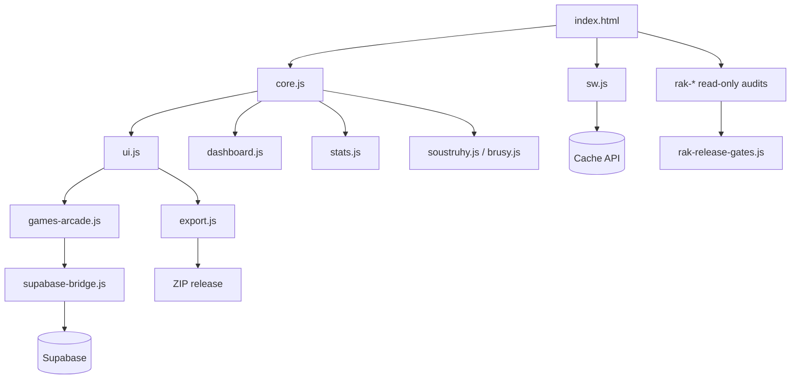
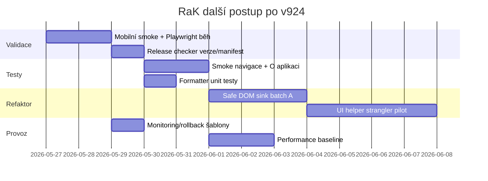

# RaK v.1.5 (924) – Finální seniorní due diligence report

## 1. Exekutivní shrnutí

Build v.1.5 (924) formálně uzavírá dosud poslané auditní/prompty dokumentačně. V repu jsou doplněné samostatné dokumenty pro architekturu, security/performance/stabilitu/UX, refaktor/testy/CI/CD, rollout/monitoring/rollback a tento finální syntetický report. V runtime je přidaný read-only helper `getRakPromptComplianceClosureHealth()`, který vrací dokumentační stav 100 % a současně nechává `mobileManualValidation` a `realPlaywrightRun` jako manual. Release gates jsou rozšířené tak, aby dokumenty byly OK, ale mobil a skutečný Playwright nebyly nepravdivě označené jako ověřené. Nebyla měněná Supabase DB, policies, online Piškvorky, online Lodě ani gameplay. Největší technické riziko zůstává coupling přes globály, ruční script pořadí, velký `ui.js`, rozsáhlý `games-arcade.js`, citlivý `supabase-bridge.js` a service worker cache/update flow. Aplikace je použitelná a dále rozvíjitelná, ale další práce má být malými bezpečnými kroky s quality gates, ne velkým rewrite. Největší praktický nedodělek po v924 není dokumentace, ale reálná validace na mobilu, hostingu a skutečný Playwright smoke běh.

## 2. Co je architektura a jak aplikace reálně funguje

RaK je statická PWA bez bundleru. `index.html` určuje pořadí skriptů, načítá externí CDN (`xlsx`, `jszip`, Google Fonts), app data, auditní `rak-*` moduly, runtime moduly a CSS. `core.js` drží `APP_KEY`, `APP_VERSION`, `ROTATION_BUILD`, globální stav `app`, datové a bezpečné DOM helpery. `ui.js` a doménové moduly vykreslují obrazovky imperativně do DOMu. `dashboard.js` řeší první obrazovku, směny, kantýnu/jídelnu a ruční sync. `games-arcade.js` a části `ui.js` drží hry, profily, leaderboardy a Piškvorky. `supabase-bridge.js` obsluhuje klienta Supabase, realtime kanál `rak-public-live-v924`, queue, RPC fallbacky, online hry a Top score. `sw.js` drží `CACHE_VERSION = v1.5-924`, app shell precache, runtime cache a offline fallback. `export.js` skládá ZIP přes JSZip a obsahuje ruční export manifest.

### Mermaid diagram architektury



## 3. Nejzávažnější problémy a proč jsou prioritní

| Priorita | Problém | Proč je prioritní | Evidence z repa |
|---:|---|---|---|
| P0/P1 | Supabase policy/DB změny bez dvoumobilového smoke testu | Může rozbít online hry a data mimo statický audit | `supabase-bridge.js`, tabulky `game_invites`, `game_sessions`, `game_stats`, RPC kontrakty |
| P1 | Service worker half-update | Chyba se projeví až po deploy/cache, ne nutně v ZIPu | `sw.js`: `CACHE_VERSION`, `APP_SHELL`, `STALE_CACHE_CLEANUP_MODE` |
| P1 | Velké DOM string renderery | Security/UX regresní plocha | `core.js` safe helpery, `ui.js`, `games-arcade.js`, `rak-dom-security-hardening.js` |
| P1 | Ruční export manifest | ZIP může chybět soubor | `export.js`: `EXPORT_TEXT_FILES`, `EXPORT_JS_FILES`, `validateRakExportManifestFiles()` |
| P1 | Chybí reálný mobilní/Playwright výsledek | Statická kontrola nevidí touch, safe-area, scroll ani hosting | `rak-mobile-smoke-audit.js`, `playwright-smoke.spec.js` |
| P2 | Performance baseline bez fyzických zařízení | Nelze poznat trend zhoršení | `ui.js`: `runRakDevicePerformanceProbe()`, `rak-performance-ci-audit.js` |

## 4. Detailní nálezy po oblastech

### Architektura

- **Ověřeno:** aplikace je modulární po souborech, ale runtime používá globály a pořadí skriptů.
- **Hypotéza:** největší budoucí úspora času bude v release checkeru a malé UI strangler vrstvě, ne v rewrite.
- **Nelze určit z dodaných podkladů:** jak se app chová na finálním hostingu po aktualizaci service workeru.

### Bezpečnost a soukromí

- **Ověřeno:** existují safe DOM helpery `escapeHtml()`, `escapeDynamicHtml()`, `setElementHtmlIfChanged()` a více DOM hardening guardů.
- **Ověřeno:** Supabase tabulky a RPC kontrakty jsou popsané v `supabase-bridge.js`, v924 je nemění.
- **Hypotéza:** CSP/SRI má smysl zavádět report-only, protože CDN a legacy string rendering by při ostrém vynucení mohly rozbít funkce.
- **Nelze určit:** skutečné hodnoty RLS policies v DB z tohoto ZIPu bez přístupu do dashboardu.

### Stabilita

- **Ověřeno:** release gates, module readiness a export preflight existují jako read-only vrstva.
- **Ověřeno:** v924 přidává `getRakPromptComplianceClosureHealth()`.
- **Hypotéza:** nejčastější reálné chyby budou cache/update flow, mobilní překryvy a online flow při špatném Supabase stavu.
- **Nelze určit:** zda po nasazení všichni klienti přejdou na `v1.5-924` bez ručního reloadu.

### Výkon

- **Ověřeno:** `ui.js` obsahuje performance probe helpery a `rak-performance-ci-audit.js` performance/CI audit.
- **Hypotéza:** největší výkonové riziko je kombinace velkého DOMu, herních canvas/loop částí a mobilního scrollu.
- **Nelze určit:** reálný FPS/startup na fyzických mobilech.

### UX

- **Ověřeno:** O aplikaci drží stručný blok `v.1.5 901–950` a ne dlouhý mikrovýpis v UI.
- **Ověřeno:** požadavky na Reaction seconds, Top score datum+čas a Daily challenge bridge jsou evidované v changelogu a guardech.
- **Nelze určit:** fyzické rozmístění na konkrétních mobilech bez testu.

## 5. Prioritizovaný backlog

| Priorita | Úkol | Typ | Dopad | Riziko |
|---:|---|---|---|---|
| P0 | Spustit reálný mobilní smoke a Playwright smoke | validace | uzavře manual gates | nízké |
| P0 | Nepouštět DB/policy změny bez dvoumobilového smoke | guard | chrání online hry | nízké |
| P1 | Přidat Node release checker verzí a manifestu | tooling | méně release chyb | nízké |
| P1 | Playwright test boot/navigace/O aplikaci/Dashboard | test | zachytí hrubé UI chyby | nízké |
| P1 | Unit test formatteru Reaction seconds a Top score času | test | chrání poslední opravy | nízké |
| P1 | Safe DOM hardening další jedné sink skupiny | security | snižuje XSS/UX riziko | střední |
| P2 | Performance baseline na A14/A15/iPhone viewport | měření | výkonový trend | nízké |
| P2 | Strangler helper pro UI karty/modaly | refaktor | sníží coupling | střední |
| P2 | Export manifest duplicate SOURCE_IDS checker | tooling | lepší compliance | nízké |

## 6. Fázový implementační plán



## 7. Test strategie a quality gates

- P0 statické gates: JS syntax, JSON, duplicitní ID, CSS brace, export manifest, verze, ZIP root struktura.
- P1 automatizace: Playwright boot/navigace/O aplikaci/Dashboard; unit formattery.
- P1 manual: mobilní safe-area, PWA reload/offline, online hry na dvou zařízeních.
- P2 trend: performance probe a Lighthouse/WebPageTest až po stabilním hostingu.

## 8. CI/CD a rollout-safe deployment

```yaml
name: rak-release-check
on: [push, pull_request]
jobs:
  check:
    runs-on: ubuntu-latest
    steps:
      - uses: actions/checkout@v4
      - uses: actions/setup-node@v4
        with:
          node-version: 20
      - run: npm ci || npm install
      - run: npm run check
      - run: npm run test:smoke
```

Deployment má být ZIP-first: sestavit ZIP, rozbalit čistě, ověřit root soubory + `assets/`, až potom nasazovat. Supabase DB/policies se nemají měnit ve stejném PR s UI/docs buildem.

## 9. Monitoring, alerting a rollback

- Monitoring minimum: release gate matrix, prompt compliance helper, module readiness, export smoke report, Supabase heartbeat, ruční mobilní checklist.
- Alerty: app boot fail P0, module missing P0, online game create/accept/save fail P0/P1, export missing file P0, SW version mismatch P1.
- Rollback: vzít poslední potvrzený ZIP, nechat DB beze změn, ověřit O aplikaci a SW cache, zapsat incident.

```js
window.RAK_ALERT_THRESHOLDS = {
  moduleMissing: 0,
  exportMissingFiles: 0,
  bootErrorRateP1: 0.02,
  supabaseHeartbeatStaleDays: 6,
  mobileSmokeRequired: true,
  playwrightRealRunRequiredBeforeProduction: true
};
```

## Patch suggestions / before-after / unified diff ukázky

### Verze checker – návrh

```diff
+ // scripts/check-release-version.js
+ assert(APP_VERSION === 'v.1.5 (924)')
+ assert(CACHE_VERSION === 'v1.5-924')
+ assert(packageJson.version === '1.5.924')
+ assert(realtimeChannel === 'rak-public-live-v924')
```

### Safe DOM renderer – before/after princip

```diff
- el.innerHTML = '<div>' + name + '</div>'
+ el.innerHTML = '<div>' + escapeDynamicHtml(name, 'profile-name') + '</div>'
```

### Export manifest check – návrh

```diff
+ const missing = manifestFiles.filter(file => !fs.existsSync(file));
+ if (missing.length) throw new Error('Export manifest missing: ' + missing.join(', '));
```

## Evidence z repa pro těžká tvrzení

| Tvrzení | Evidence |
|---|---|
| Verze je centrální release signál | `core.js` `APP_VERSION`, `sw.js` `CACHE_VERSION`/`SW_APP_VERSION`, `package.json`, `export.js` manifest, `supabase-bridge.js` realtime kanál |
| Supabase online flow je citlivé | `supabase-bridge.js` tabulky `game_invites`, `game_sessions`, `game_stats`, RPC kontrakty a realtime `REALTIME_TABLES` |
| PWA update vyžaduje ruční ověření | `sw.js` `APP_SHELL`, `STATIC_CACHE`, `RUNTIME_CACHE`, `OFFLINE_FALLBACK_HTML` |
| Export je ruční manifest | `export.js` `EXPORT_SOURCE_IDS`, `EXPORT_TEXT_FILES`, `EXPORT_BINARY_FILES` |
| DOM hardening už existuje, ale není hotový rewrite | `core.js` safe helpery, `rak-dom-security-hardening.js`, `games-*dom-hardening` helpery |
| Prompt compliance v924 je read-only | `rak-due-diligence-progress.js` `getRakPromptComplianceClosureHealth()` |

## 10. Doporučené první kroky na příštích 7 dnů a 30 dnů

### Příštích 7 dnů

1. Spustit reálný Playwright smoke skeleton.
2. Projít mobilní smoke checklist na 2–3 zařízeních.
3. Přidat Node release checker verzí a export manifestu.
4. Přidat unit test pro Reaction seconds formatter a datum+čas Top score.
5. Zapsat výsledky validace do samostatného dokumentu.

### Příštích 30 dnů

1. Převést první skupinu DOM sinků na safe helpery.
2. Vytvořit malý UI strangler helper pro karty/modaly.
3. Nasbírat performance baseline.
4. Přidat scheduled/staging Playwright smoke.
5. Teprve po dvoumobilových testech řešit případné Supabase policy hardening kroky.

## Jasné oddělení stavu

### Ověřeno

- Dokumenty v924 jsou doplněné.
- Export manifest byl doplněn o nové dokumenty.
- Verze byla navýšena na v.1.5 (924).
- Helper `getRakPromptComplianceClosureHealth()` je read-only.
- Release gates rozlišují dokumentační OK a manual validaci.

### Hypotéza

- Nejrychlejší stabilizační návratnost bude v release checkeru a Playwright smoke, ne v rewrite.
- Největší runtime rizika po deploy budou SW cache, mobilní layout a online flow.

### Nelze určit z dodaných podkladů

- Reálný stav mobilního layoutu na fyzických telefonech.
- Výsledek skutečného Playwright běhu.
- Stav produkční Supabase policies mimo klientský snapshot.
- Chování na cílovém hostingu po service worker update.

Nejlepší další krok teď je: spustit skutečný Playwright smoke a projít ruční mobilní checklist na aktuálním ZIPu v924, aby se dokumentační 100 % proměnilo i v reálnou validační jistotu.
