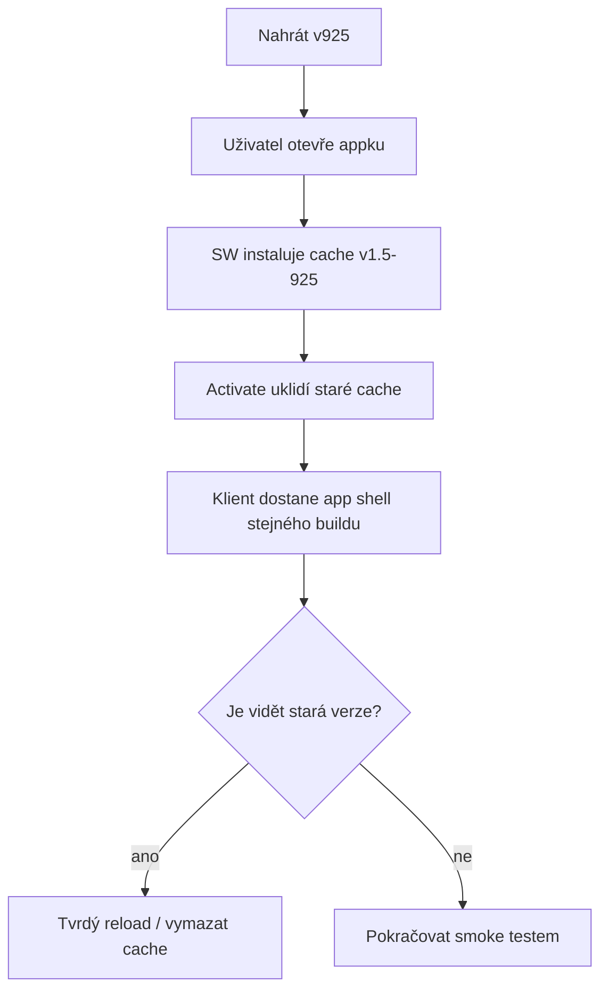

# RaK v.1.5 (925) – post-release validace a PWA update

## Cíl
Po nasazení je potřeba ověřit, že uživatelé nedostanou half-updated klienta: nová stránka s novým service workerem musí používat stejnou verzi cache, app shellu a runtime souborů.

## Release day checklist
| Krok | Kontrola | Očekávaný výsledek |
|---|---|---|
| 1 | Nahrát ZIP v925 na hosting/staging. | Root obsahuje přímo soubory a jen složku `assets/`. |
| 2 | Tvrdý reload v prohlížeči. | `APP_VERSION` ukazuje `v.1.5 (925)`. |
| 3 | Service worker. | Cache verze je `v1.5-925`, staré cache se uklidí při activate. |
| 4 | Export. | Exportovaný ZIP se jmenuje podle v925. |
| 5 | Release gates. | Statické blockery = 0, manual položky zůstávají mobil/Playwright. |
| 6 | Mobilní smoke. | Nejsou P0 problémy na Dashboardu, Hrách, Top score a exportu. |

## PWA update flow

## Rollback trigger
Rollback na poslední potvrzenou verzi je vhodný, když nastane některý z těchto stavů:
- aplikace po reloadu nenaběhne,
- spodní lišta nejde používat,
- Top score nebo hry padají v běžném flow,
- PWA cache vrací mix starých a nových souborů,
- export ZIPu selže,
- online Piškvorky/Lodě se po nasazení nerozjedou na dvou zařízeních.

## Co nelze ověřit staticky
- skutečný update service workeru na hostingu,
- chování cache na mobilu po návratu z offline režimu,
- reálné síťové latence Supabase,
- online hry na dvou telefonech,
- výkon na slabším zařízení.
