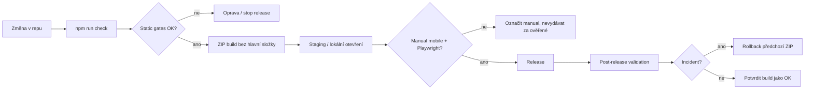

# RaK v.1.5 (924) – Rollout, monitoring a rollback plán

## Stav promptu

- Dokumentační prompt compliance: **100 %**.
- V924 doplňuje postupy a read-only gate; neprovádí hosting, monitoring ani DB změny.
- Reálné ověření hostingu, mobilu a monitoringu zůstává manual.

## Monitoring matrix

| Oblast | Signál | Zdroj | Frekvence | OK stav | Akce při problému |
|---|---|---|---|---|---|
| Boot aplikace | JS error count, module readiness | `getRakModuleReadinessHealth()` | při startu | missing/error = 0 | rollback build / oprava script pořadí |
| Verze | APP/cache/package/realtime/export | release checker + `getRakReleaseGateMatrixHealth()` | před ZIPem | vše 924 | zadržet ZIP |
| Service worker | cache status, app shell count | `sw.js` message `sw-version`, `getSwCacheStatus()` | po deploy | správná cache `v1.5-924` | hard reload instrukce / rollback |
| Export ZIP | manifest preflight | `validateRakExportManifestFiles()` | před vydáním | missing = 0, duplicit = 0 | doplnit manifest |
| Supabase heartbeat | poslední OK, chyby, skip | `supabase-bridge.js` keepalive status | denně/týdně | poslední OK v limitu | zkontrolovat Free pause / RPC |
| Online hry | create/accept/save | ruční dvoumobilový smoke | release day | obě hry projdou | rollback / DB freeze |
| Top score | datum+čas, sekundy Reaction | UI + helpery | release day | správný formát | opravit formatter/cache |
| Mobile UX | safe-area, scroll, spodní lišta | ruční checklist | release day | bez překryvů | rollback CSS/layout změny |
| Performance | startup/route/hry | app performance probe | po vydání | baseline bez zhoršení | odložit refaktor, profilovat |
| Prompt compliance | dokumenty + manual gates | `getRakPromptComplianceClosureHealth()` | před ZIPem | docs 100 %, manual jasně označeno | doplnit docs nebo ruční testy |

## Alert matrix

| Alert | Trigger | Severity | Reakce | Rollback? |
|---|---|---:|---|---|
| App nejde načíst | prázdná stránka / JS syntax error | P0 | okamžitě stáhnout build, obnovit předchozí ZIP | Ano |
| Chybí modul v module readiness | missing/error > 0 | P0 | porovnat index/sw/export manifest | Ano, pokud po deploy |
| Online hry nejdou vytvořit/přijmout | Piškvorky nebo Lodě fail na dvou mobilech | P0/P1 | neměnit DB; ověřit poslední ZIP a Supabase stav | Ano |
| Top score se nezapisuje | nová hra bez score | P1 | ověřit local + Supabase score bridge | Podle dopadu |
| SW drží starou verzi | O aplikaci ukazuje starý build po reloadu | P1 | hard reload, cache cleanup, ověřit `CACHE_VERSION` | Pokud masové |
| Export ZIP chybí soubor | preflight missing > 0 | P0 | nevydávat ZIP, doplnit manifest | Ne, před deploy |
| Mobilní překryv | spodní lišta zakrývá hru/score | P1 | rollback CSS/layout změny | Ano, pokud běžné |
| Supabase heartbeat fail > 7 dní | Free projekt pauzuje | P1 | ručně unpause, ověřit keepalive RPC | Ne nutně |

## Rollback triggery

- Aplikace se po nasazení nespustí.
- Více než jeden hlavní modul chybí nebo selže v module readiness.
- Service worker vrací starý/mixovaný build a hard reload nepomůže.
- Online Piškvorky nebo Lodě selžou v create/accept/save po buildu, který se online flow neměl dotknout.
- Top score nebo profily mažou/skrývají data nečekaně.
- Mobilní layout blokuje hlavní funkci.
- Export ZIP z aplikace má jinou strukturu než kořenové soubory + `assets/`.

## Release day checklist

1. Potvrdit zdrojový ZIP a build číslo.
2. Ověřit, že změny jsou v povoleném scope.
3. Spustit `npm run check`.
4. Spustit JSON validaci `package.json` a `manifest.webmanifest`.
5. Spustit duplicitní ID kontrolu.
6. Spustit CSS brace kontrolu.
7. Spustit export manifest kontrolu.
8. Zkontrolovat verze: `APP_VERSION`, `CACHE_VERSION`, `SW_APP_VERSION`, package, realtime kanál, export manifest, changelog, O aplikaci.
9. Sestavit ZIP bez vnitřní hlavní složky.
10. Rozbalit ZIP do čisté složky a zkontrolovat, že jediná složka je `assets/`.
11. Ručně otevřít `index.html` nebo staging hosting.
12. Mobilní smoke označit reálně jako provedeno až po testu.

## Post-release validation checklist

- [ ] O aplikaci ukazuje `v.1.5 (924)`.
- [ ] Service worker po reloadu ukazuje cache `v1.5-924`.
- [ ] Dashboard se vykreslí bez ručního překliknutí.
- [ ] Kantýna/jídelna běžný a mimořádný režim sedí.
- [ ] Reaction Test Top score ukazuje sekundy.
- [ ] Top score ukazuje datum i čas.
- [ ] Denní challenge zapisuje do svého Top score.
- [ ] Offline AI Piškvorky fungují stejně jako před buildem.
- [ ] Online Piškvorky a Lodě jsou beze změny a projdou dvoumobilovým smoke testem.
- [ ] Export ZIP z aplikace projde preflightem.
- [ ] Mobilní safe-area a spodní lišta nic nezakrývá.

## Emergency rollback checklist

1. Zastavit další deploy.
2. Vzít poslední potvrzený ZIP před incidentem.
3. Nasadit předchozí ZIP beze změn DB/policies.
4. Přinutit klienty k reloadu změnou cache verze jen pokud je rollback build nový.
5. Ověřit O aplikaci a SW cache na mobilu.
6. Ověřit online hry jen pokud incident souvisel s online flow.
7. Zapsat incident: co selhalo, kdy, build, zařízení, kroky reprodukce.
8. Nový fix udělat jako samostatný build + changelog.

## Pseudokonfigurace error tracking / telemetry / alerting

```js
// Minimalistická client-side telemetry pseudokonfigurace – nezapínat bez privacy review.
window.RAK_TELEMETRY_CONFIG = {
  enabled: false,
  mode: 'report-only',
  sampleRate: 0.05,
  version: window.APP_VERSION,
  redact: ['profileName', 'inviteCode', 'userText', 'localStorageValue'],
  events: [
    'boot_error',
    'module_missing',
    'sw_update_mismatch',
    'export_preflight_failed',
    'supabase_rpc_failed'
  ]
};
```

```yaml
# Pseudokonfigurace alertů
alerts:
  boot_error_rate:
    threshold: 2% over 30m
    severity: P1
  module_missing:
    threshold: 1 event
    severity: P0
  export_preflight_failed:
    threshold: 1 event in release session
    severity: P0
  supabase_heartbeat_stale:
    threshold: last_success > 6d
    severity: P1
```

## Minimální observability stack

- Interní read-only diagnostika: `getRakReleaseGateMatrixHealth()`, `getRakPromptComplianceClosureHealth()`, module readiness, export smoke report.
- Ruční release checklist v markdownu.
- Browser console export nebo screenshot z Diagnostiky.
- Supabase dashboard kontrola projektu/heartbeat.
- GitHub Actions pro `npm run check` a Playwright smoke.

## Pokročilejší observability varianta

- GlitchTip/Sentry v report-only režimu s přísnou redakcí a minimálním samplingem.
- Uptime monitor hostingu pro `index.html` a `manifest.webmanifest`.
- Lighthouse CI pro trend PWA/performance.
- Playwright scheduled smoke na stagingu.
- Supabase edge/function nebo cron heartbeat audit pouze pokud nebude narušovat Free tier pravidla.

## Mermaid release flow diagram



## PWA/service worker rollback/update flow

1. Každý build má novou `CACHE_VERSION`, v924 `v1.5-924`.
2. Service worker precachuje `APP_SHELL` do `STATIC_CACHE`.
3. Aktivace čistí staré RaK cache podle `isRakManagedCacheKey()` a `isCurrentRakCacheKey()`.
4. Klient dostane `sw-version` zprávu s cache a app verzí.
5. Při rollbacku musí rollback ZIP používat vlastní vyšší cache build nebo jasně řízený downgrade postup, jinak klient může držet starou cache.
6. Při podezření na half-update: zavřít PWA, otevřít v prohlížeči, tvrdý reload, případně vymazat site data.

## Jak zabránit half-updated klientům

- Vždy bump `CACHE_VERSION` a `SW_APP_VERSION`.
- Držet `APP_SHELL` a export manifest synchronní.
- Nemíchat runtime změny a DB/policy změny.
- Po deploy udělat post-release reload na dvou zařízeních.
- V UI jasně zobrazit verzi v O aplikaci.
- Při závažné změně přidat nenásilné upozornění „Je dostupná nová verze, otevři appku znovu“.

## Co nelze ověřit bez reálného hostingu/mobilu/monitoringu

- Chování service worker update flow na skutečné URL.
- Chování PWA po přidání na plochu.
- CDN a font fallback při horší síti.
- Reálné online flow dvou zařízení přes Supabase realtime.
- Výkon her a scrollu na fyzickém zařízení.
- Alerting/telemetry, dokud není reálně zapnutý a privacy reviewed.
